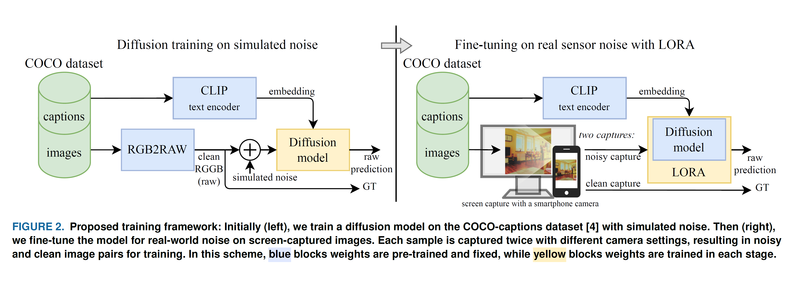

# Tell Me What You See: Text-Guided Real-World Image Denoising

[](https://arxiv.org/abs/2312.10191)

### [**Erez Yosef**](https://erezyosef.github.io/), [**Raja Giryes**](https://www.giryes.sites.tau.ac.il/)  
Tel Aviv University, Israel.


## 📌 Abstract

Image reconstruction from noisy sensor measurements is challenging and many methods have been proposed for it. Yet, most approaches focus on learning robust natural image priors while modeling the scene's noise statistics. In extremely low-light conditions, these methods often remain insufficient. Additional information is needed, such as multiple captures or, as suggested here, scene description. As an alternative, we propose using a text-based description of the scene as an additional prior, something the photographer can easily provide. Inspired by the remarkable success of text-guided diffusion models in image generation, we show that adding image caption information significantly improves image denoising and reconstruction for both synthetic and real-world images.

###  Project Diagram Overview



## 🧪 Results

To evaluate the effectiveness of our approach, we conducted extensive experiments on real-world and synthetic data. The figure below highlights key qualitative results, showcasing reconstructed outputs under challenging noise conditions captured in the real world using a Samsung S21 camera, compared to other non-text-guided reconstruction approaches.


---

## 🛠️ Installation

Before starting, ensure you have Python 3 installed and a CUDA-compatible GPU if you plan to use GPU acceleration.

**Install PyTorch and dependencies:**

```bash
python3 -m pip install torch==1.8.1+cu102 torchvision==0.9.1+cu102 torchaudio==0.8.1 \
 -f https://download.pytorch.org/whl/torch_stable.html
python3 -m pip install git+https://github.com/openai/CLIP.git
 
cd /path-to-clone-aux-repo
git clone -b raw_denoiser https://github.com/ErezYosef/guided-diffusion-clip
   
```

**Install the guided-diffusion auxiliary package:**

```bash
cd /path-to-clone-aux-repo
python3 -m pip install -e .
```

## 📁 Downloads and Setup

### Datasets 

Our model was trained and designed to denoise noisy image datasets captured using the following cameras:

- **Allied Vision Camera**  
- **Samsung Galaxy S21 Camera**

To use the model, place the datasets in the required directory path.  
Download links for the datasets will be provided shortly.

### Models 
To run the model, ensure the following are properly set up in the specified directories:

* Model Weights: Download base diffusion model checkpoints.
* LoRA Weights: Store LoRA fine-tuned weights at the path (specified by `--lora_checkpoint`).


## 📦 Usage


### Run Inference on Allied Vision Camera Data

Run the following command from the `Denoising` directory to sample images using a LoRA checkpoint and a specific configuration:

```bash
cd ./Denoising
CUDA_VISIBLE_DEVICES=0 python diffusion/image_sample.py \
  --config_file diffusion/coco_configs/allied_condition_sample_config.yaml \
  -f 1653 \
  -d loracond_allied_res \
  --ntimes 1 \
  --trim_len 30 \
  --lora_checkpoint /data1/erez/Documents/sidd/diffusion_coco/250122_1010_lora_allied_cond_res130_gac2/ema_0.9999_1300000.pt \
  --format_strs log
```

### Run Inference on Samsung S21 Camera Data

To sample images from S21 camera data using a different configuration:

```bash
cd ./Denoising
CUDA_VISIBLE_DEVICES=0 python diffusion/image_sample.py \
  --config_file diffusion/coco_configs/s_condition_sample_config.yaml \
  -f 1653 \
  -d s21_lora_sample \
  --ntimes 1 \
  --trim_len 30 \
  --format_strs log
```

---


## 📜 Citation

If you find this work useful in your research, please cite:

```bibtex
@article{yosef2023tell,
  title={Tell Me What You See: Text-Guided Real-World Image Denoising},
  author={Yosef, Erez and Giryes, Raja},
  journal={arXiv preprint arXiv:2312.10191},
  year={2023}
}
```

## 📬 Contact

If you have any questions or inquiries, feel free to reach out:  
### **Erez Yosef**, [Erez.Yo@gmail.com](mailto:erez.yo@gmail.com)


